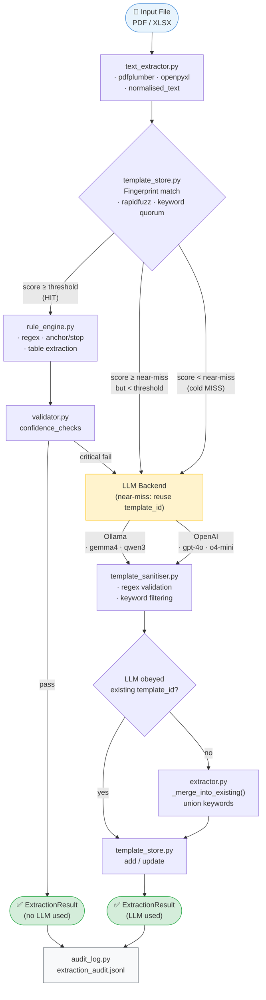

# doc-schema-extractor

Template-guided PDF/XLSX extraction pipeline for recurring supplier documents, with LangSmith tracing, Streamlit chat UI, and rotating file-based debug logging.

---

## Architecture

### Processing Flow



### Module Map

```
src/doc_schema_extractor/
├── extractor.py          # Orchestrator — wires all modules, near-miss logic
├── text_extractor.py     # pdfplumber / openpyxl → DocumentText
├── template_store.py     # JSON store, fingerprint scoring, find_family_match()
├── rule_engine.py        # Regex + table extraction from DocumentText
├── validator.py          # Confidence checks (not_null, gt, lt, regex_match)
├── template_sanitiser.py # Post-LLM: invalid regex pruning, keyword filtering
├── audit_log.py          # JSONL audit trail (extraction_audit.jsonl)
├── models.py             # Pydantic: Template, Fingerprint, ExtractionRule, ...
├── tracing.py            # LangSmith span helpers
├── logging_utils.py      # Rotating file logger
├── streamlit_app.py      # Chat UI (upload → extract → Q&A)
└── backends/
    ├── base.py           # LLMBackend ABC + SYSTEM_PROMPT + EXISTING_TEMPLATE_PREFIX
    ├── ollama.py         # Ollama HTTP backend
    └── openai_backend.py # OpenAI backend
```

---

## Template Store

Templates are stored as a single JSON file (`templates/store.json`). Each entry maps a `template_id` to a template definition inferred by the LLM on first encounter, then reused for all future documents of the same type.

### Example template (structure only)

```json
{
  "<template_id>": {
    "template_id": "<snake_case_id_v1>",
    "fingerprint": {
      "required_keywords": ["<structural_keyword>", "..."],
      "supplier_hint": "<Company Name GmbH>",
      "doc_type": "<delivery_note|invoice|order_confirmation|...>",
      "keyword_quorum": 0.6
    },
    "extraction_rules": [
      {
        "field": "<field_name>",
        "type": "<string|date|decimal|table>",
        "regex": "<single-capture-group Python regex or null>",
        "anchor_regex": "<table start pattern or null>",
        "stop_regex": "<table end pattern or null>",
        "columns": ["<col1>", "<col2>"],
        "date_format": "<%d.%m.%Y or null>"
      }
    ],
    "confidence_checks": [
      { "field": "<field_name>", "not_null": true, "gt": null, "lt": null, "regex_match": null }
    ],
    "metadata": { "llm_generated": true },
    "version": 1,
    "created_at": "<ISO timestamp>",
    "updated_at": "<ISO timestamp>",
    "hit_count": 0
  }
}
```

### Template lifecycle

| Event | Action |
|---|---|
| First document of a new type | LLM generates template → saved to store |
| Second document, score ≥ threshold | Rule engine extracts → no LLM call |
| Second document, near-miss (score ≥ 0.3) | LLM updates existing template (union keywords) |
| Validation fails critically | LLM repair pass → template updated |
| `hit_count` increments | On every successful template HIT |

---

## Supported LLM Backends
- **Ollama** (local, default): `gemma4:e4b-it-qat`, `qwen3.5:2b`, `gemma4:e2b`
- **OpenAI**: `gpt-4o`, `gpt-4o-mini`, `o4-mini`

---

## Setup

```bash
curl -LsSf https://astral.sh/uv/install.sh | sh
git clone https://github.com/anbilly19/doc-schema-extractor
cd doc-schema-extractor
uv sync
cp .env.example .env
```

## Logging

The app writes rotating debug logs to `./logs/doc_schema_extractor.log` by default.

Config in `.env`:

```bash
LOG_LEVEL=DEBUG
LOG_DIR=./logs
LOG_FILE=doc_schema_extractor.log
LOG_MAX_BYTES=10485760
LOG_BACKUP_COUNT=5
LOG_RAW_TEXT_PREVIEW_CHARS=2000
```

Logged events include:
- document intake and file type
- template store load/save/list/delete
- template match candidates + scores
- rule engine extraction per field
- validator failures
- LLM backend calls and parse failures
- Streamlit chat questions
- exception stack traces

Raw document text is truncated to `LOG_RAW_TEXT_PREVIEW_CHARS` to reduce leakage and log bloat.

## LangSmith

Set these in `.env` to enable tracing:

```bash
LANGSMITH_TRACING=true
LANGSMITH_API_KEY=lsv2_pt_...
LANGSMITH_PROJECT=doc-schema-extractor
LANGSMITH_ENDPOINT=https://api.smith.langchain.com
```

## Run

```bash
uv sync
uv run dse extract path/to/invoice.pdf
uv run streamlit run src/doc_schema_extractor/streamlit_app.py
```

## Environment variables

```bash
# LLM backend selection
LLM_BACKEND=ollama                   # ollama | openai
OLLAMA_DEFAULT_MODEL=gemma4:e4b-it-qat
OPENAI_DEFAULT_MODEL=gpt-4o-mini

# Template matching
TEMPLATE_MATCH_THRESHOLD=0.75       # score >= this → HIT (no LLM)
NEAR_MISS_MIN_SCORE=0.3             # score >= this → near-miss (LLM updates existing)
VALIDATION_FALLBACK_THRESHOLD=2     # critical null fields before LLM repair

# Paths
TEMPLATE_STORE_PATH=templates/store.json
```

## License

MIT
